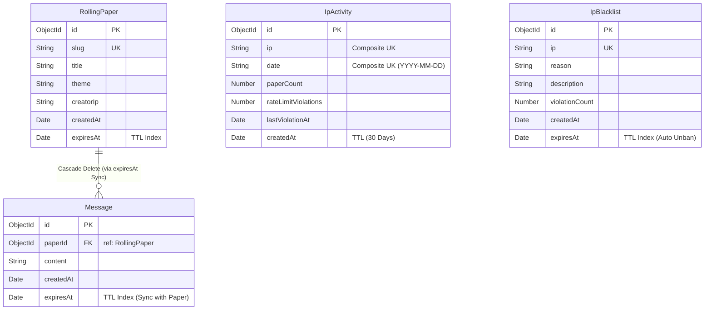

# 🗄️ 5. 데이터베이스 정의서 (`database_schema.md`)

본 문서는 **Haroo Paper** 프로젝트에서 사용하는 데이터베이스 유형, Mongoose 데이터 스키마 정의서, 복합 및 TTL 인덱스 정책, 테이블 간 관계 스펙을 기술합니다.

---

## 🗄️ 1. 데이터베이스 개요

* **데이터베이스 종류:** MongoDB (NoSQL)
* **연동 라이브러리:** Mongoose ODM (`v9.1.3`)
* **커넥션 헬퍼 파일:** `backend/config/database.js` (Mongoose connection pool 설정 및 에러 모니터링 수립)

---

## 📋 2. Mongoose 콜렉션 정의 및 필드 리스트

### ① `RollingPaper` 콜렉션 (`models/rolling-paper.js`)
롤링페이퍼 판의 메타 정보를 보관하는 콜렉션입니다. 10일 후 자동 삭제 기능이 내장되어 있습니다.

| 필드명 (Field) | 데이터 타입 | 필수(Req) | 제약 조건 및 설명 |
| :--- | :--- | :---: | :--- |
| `_id` | ObjectId | Yes | 시스템 고유 식별자 (PK) |
| `slug` | String | Yes | 고유 코드 (정확히 8글자, 단방향 인덱스, Unique) |
| `title` | String | No | 페이퍼 제목 (최대 40자, 미입력 시 `null`) |
| `theme` | String | Yes | 페이퍼 디자인 테마 키 (예: `theme_basic`) |
| `creatorIp` | String | No | 생성자 클라이언트 IP (단일 인덱스, 어뷰징 추적용) |
| `createdAt` | Date | Yes | 생성 시간 (기본값: `Date.now`) |
| `expiresAt` | Date | Yes | **만료 일시 (TTL 인덱스: `{ expires: 0 }`)** 생성 시점 기준 `10일(TTL_DAYS)` 뒤로 계산되어 저장되며, 만료일에 도달 시 MongoDB 시스템에 의해 자동 제거 |

### ② `Message` 콜렉션 (`models/message.js`)
롤링페이퍼에 작성되는 개별 텍스트 포스트잇 데이터 콜렉션입니다.

| 필드명 (Field) | 데이터 타입 | 필수(Req) | 제약 조건 및 설명 |
| :--- | :--- | :---: | :--- |
| `_id` | ObjectId | Yes | 시스템 고유 식별자 (PK) |
| `paperId` | ObjectId | Yes | 소속 롤링페이퍼 ID (`RollingPaper` 레퍼런스, FK) |
| `content` | String | Yes | 본문 내용 (최대 500자) |
| `createdAt` | Date | Yes | 작성 시간 (기본값: `Date.now`) |
| `expiresAt` | Date | Yes | **만료 일시 (TTL 인덱스: `{ expires: 0 }`)** 롤링페이퍼판의 `expiresAt`과 동기화되어 판이 날아갈 때 종속된 모든 메시지가 완벽히 함께 소멸되도록 보장 (Cascade Delete 구현체) |

### ③ `IpActivity` 콜렉션 (`models/ip-activity.js`)
일일 롤링페이퍼 생성 한도 관리 및 위반 내역 모니터링을 위한 이력 데이터 콜렉션입니다.

| 필드명 (Field) | 데이터 타입 | 필수(Req) | 제약 조건 및 설명 |
| :--- | :--- | :---: | :--- |
| `_id` | ObjectId | Yes | 시스템 고유 식별자 (PK) |
| `ip` | String | Yes | 클라이언트 IP 주소 |
| `date` | String | Yes | 날짜 문자열 (형식: `YYYY-MM-DD`, 복합 인덱스) |
| `paperCount` | Number | Yes | 당일 생성한 롤링페이퍼 누적 개수 (기본값: `0`) |
| `rateLimitViolations` | Number | Yes | 당일 레이트 리밋 위반 횟수 (기본값: `0`) |
| `lastViolationAt` | Date | No | 최근 위반 발생 시간 (기본값: `null`) |
| `createdAt` | Date | Yes | 생성 시간 (TTL: 30일 경과 후 자동 파기, 2592000초) |

### ④ `IpBlacklist` 콜렉션 (`models/ip-blacklist.js`)
어뷰징 행위로 차단된 IP 리스트를 관리하며, 차단 기한이 만료되면 자동으로 블랙리스트에서 탈퇴(차단 해제)됩니다.

| 필드명 (Field) | 데이터 타입 | 필수(Req) | 제약 조건 및 설명 |
| :--- | :--- | :---: | :--- |
| `_id` | ObjectId | Yes | 시스템 고유 식별자 (PK) |
| `ip` | String | Yes | 차단된 클라이언트 IP 주소 (Unique, Index) |
| `reason` | String | Yes | 차단 분류 (`AUTO_RATE_LIMIT` / `AUTO_DAILY_LIMIT` / `MANUAL`) |
| `description` | String | No | 차단 세부 사유 설명 |
| `violationCount` | Number | Yes | 차단 당시 누적 위반 횟수 (기본값: `0`) |
| `createdAt` | Date | Yes | 차단 등록 일시 |
| `expiresAt` | Date | Yes | **차단 만료 시간 (TTL 인덱스: `{ expires: 0 }`)** 만료되는 시점에 DB에서 행이 자동 완전 삭제되어 영구 락이 자동 해제됨 |

---

## ⚡ 3. 인덱스 및 성능 설계 명세

속도 향상 및 페이징 성능, 자동 백그라운드 데이터 정리를 위한 인덱스 명세는 아래와 같습니다.

### ① TTL 인덱스 (Time-To-Live)
* **`RollingPaper.expiresAt` (expires: 0):** 생성 10일 후 페이퍼 정보 완전 증발.
* **`Message.expiresAt` (expires: 0):** 종속된 페이퍼와 동일 시점에 메시지 일괄 증발.
* **`IpBlacklist.expiresAt` (expires: 0):** 차단 기간 만료 시 자동 차단 해제.
* **`IpActivity.createdAt` (expires: 30 days):** IP 일별 통계 로그는 30일 뒤 자동 삭제하여 서버 디스크 관리 최적화.

### ② 복합 및 고유 인덱스 (Compound & Unique Indexes)
* **`Message` 인덱스:** `{ paperId: 1, createdAt: -1 }`
  * **목적:** 특정 롤링페이퍼의 메시지들을 최신 작성순으로 역정렬하고 페이징(`skip`, `limit`) 처리하는 쿼리의 풀스캔을 회피하기 위한 초고효율 인덱스.
* **`IpActivity` 인덱스:** `{ ip: 1, date: 1 }` (Unique 설정)
  * **목적:** 단일 IP의 일일 생성 수를 고유 관리하고, 충돌 없는 고속의 `findOneAndUpdate` (upsert)를 수행하기 위한 복합 키.

---

## 🔗 4. 관계 데이터 모델링 (Entity Relationship Model)

